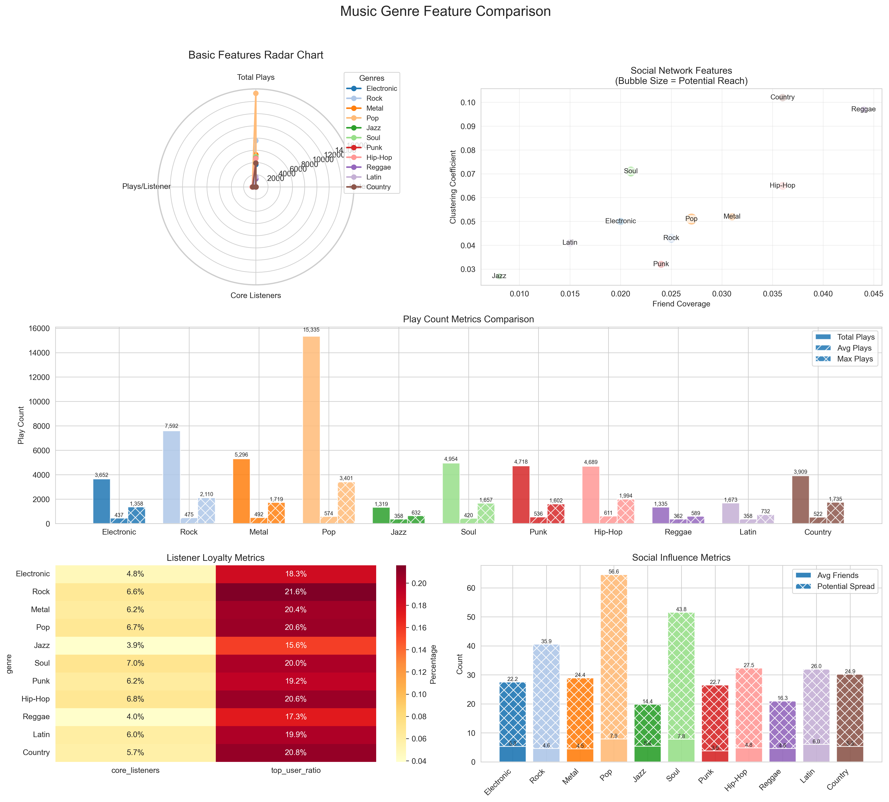

---
## About

这个项目是在relationLLM的基础上，利用大模型提升三个数据集标准分类任务的效果。
原项目代码：https://github.com/rllm-team/rllm

### Classification tasks: 
- **tml1m:** 
- **tlf2k:**  音乐家流派分类任务
- **tacm12k:**  


## How to Try tlf2k:
musician_classification文件夹内是tlf2k任务的代码。

- simple_prompt.py 是采用最简单直接的分类模板；
- llm_vote.py 引入了多角色投票机制；
- statistical_prompt.py 在投票基础上为大模型提供了领域知识。

运行之前，需要将代码文件中的大模型api-key替换成有效key。
```bash
# cd ./musician_classification
# set parameters if necessary

python simple_prompt.py
python llm_vote.py
python statistical_prompt.py
```
### 可视化结果
tlf2k任务中对每个流派的音乐家平均特征做了统计，可视化如下：



## Citation
```
@article{rllm2024,
      title={rLLM: Relational Table Learning with LLMs}, 
      author={Weichen Li and Xiaotong Huang and Jianwu Zheng and Zheng Wang and Chaokun Wang and Li Pan and Jianhua Li},
      year={2024},
      eprint={2407.20157},
      archivePrefix={arXiv},
      primaryClass={cs.AI},
      url={https://arxiv.org/abs/2407.20157}, 
}
```
